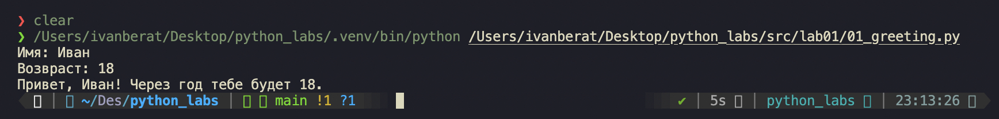
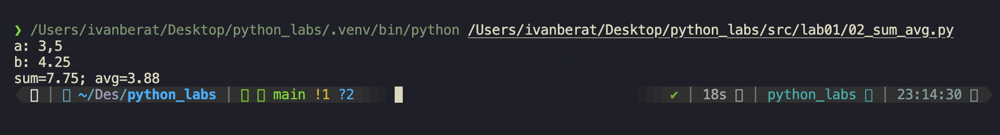
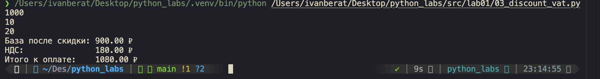
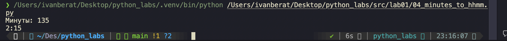
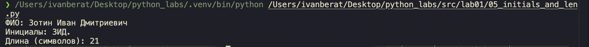

#lab01

## Задание 1 — Приветствие

Файл: `01_greeting.py`  
Спрашивает имя и возраст, а потом просто выводит приветствие.

## Задание 2 — Сумма и среднее

Файл: `02_sum_avg.py`  
Берет два дробных числа, складывает их и считает среднее до двух знаков

## Задание 3 — Чек: скидка и НДС

Файл: `03_discount_vat.py`  
Считает цену со скидкой, накидывает сверху процент НДС и выводит чек с копейками

## Задание 4 — Минуты → ЧЧ:ММ

Файл: `04_minutes_to_hhmm.py`  
Переводит обычные минуты в нормальное время вида часы:минуты, дописывая ноль, если надо.

## Задание 5 — Инициалы и длина строки

Файл: `05_initials_and_len.py`  
Принимает ФИО с любым количеством пробелов, собирает первые буквы в заглавные инициалы с точкой и считает длину чистой строки.

