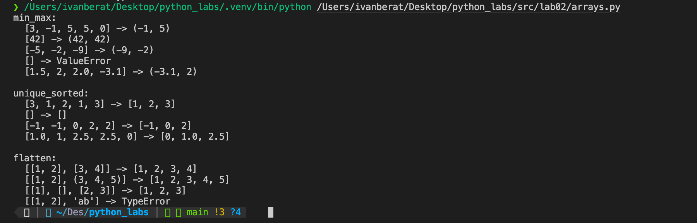
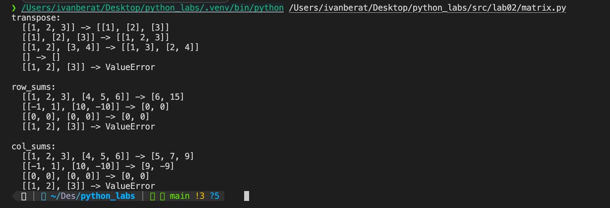
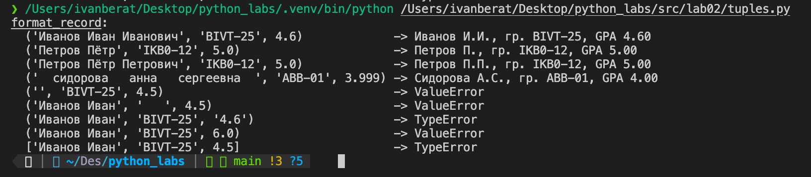

# Отчет по лабораторной работе №2

## Задание A

*Рис. 1. Результат выполнения arrays.py (min_max, unique_sorted, flatten)*

## Задание B

*Рис. 2. Результат выполнения matrix.py (transpose, row_sums, col_sums)*

## Задание C

*Рис. 3. Результат выполнения tuples.py (format_record)*